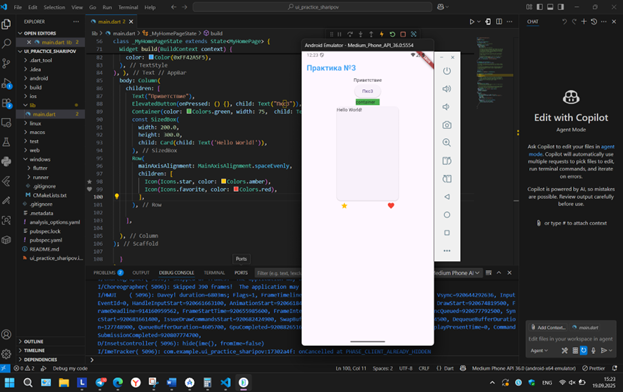

# Отчет по практической работе №3 

## Студент: Sharipov Danis

## 1. Использованные виджеты 
В ходе практической работы были использованы следующие виджеты Flutter: 
•	Scaffold - базовый каркас интерфейса с AppBar и body 
•	AppBar - верхняя панель приложения с заголовком 
•	Column - вертикальное расположение элементов 
•	Text - текстовые элементы с различным стилем 
•	ElevatedButton - кнопка с приподнятым эффектом 
•	Container - контейнер для оформления содержимого 
•	SizedBox - виджет для создания отступов 
•	Card - карточка с закругленными углами и тенью 
•	Row - горизонтальное расположение элементов 
•	Icon - отображение иконок 

## 2. Изменение стилей и цветов
В работе применялись следующие стили и цвета: 
Цвета: 
•	AppBar: синий фон (Colors.blue) и белый текст 
•	Текст приветствия: стандартный цвет 
•	Кнопка: стандартный цвет фона (зеленый) 
•	Container: зеленый фон (Colors.green) 
•	Иконки: желтый (Colors.amber) и красный (Colors.red) 
Шрифты: 
•	Заголовок AppBar: размер 24, жирное начертание (FontWeight.bold) 
•	Основной текст: стандартные параметры 
Компоновка: 
•	Добавлены отступы с помощью SizedBox 

